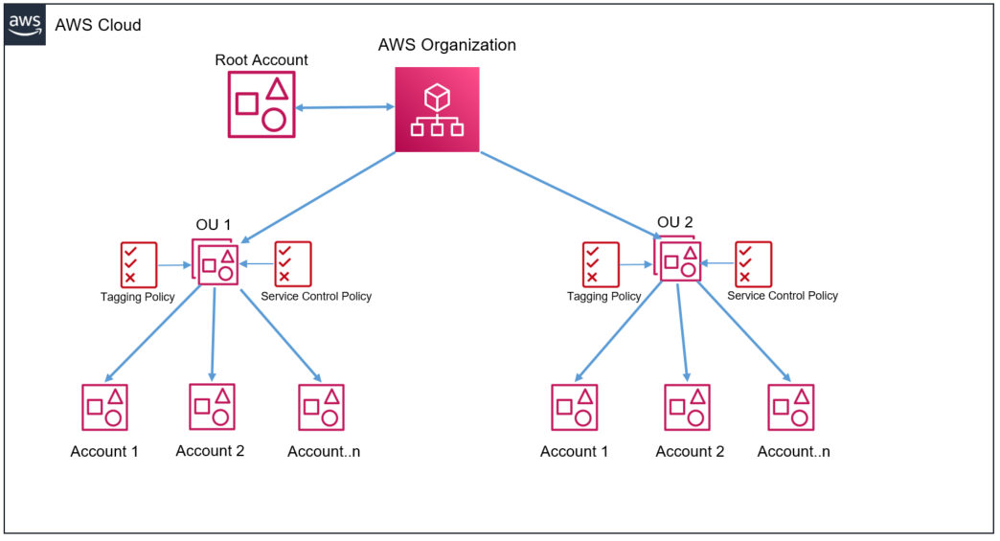

Implement AWS resource tagging strategy using AWS Tag Policies and Service Control Policies (SCPs)

https://aws.amazon.com/pt/blogs/mt/implement-aws-resource-tagging-strategy-using-aws-tag-policies-and-service-control-policies-scps/

1. SCPs can only be applied to member accounts in an organization. They have NO effect on users or roles in the management account.
2. 
https://d2908q01vomqb2.cloudfront.net/972a67c48192728a34979d9a35164c1295401b71/2021/10/26/fig1arun.png
